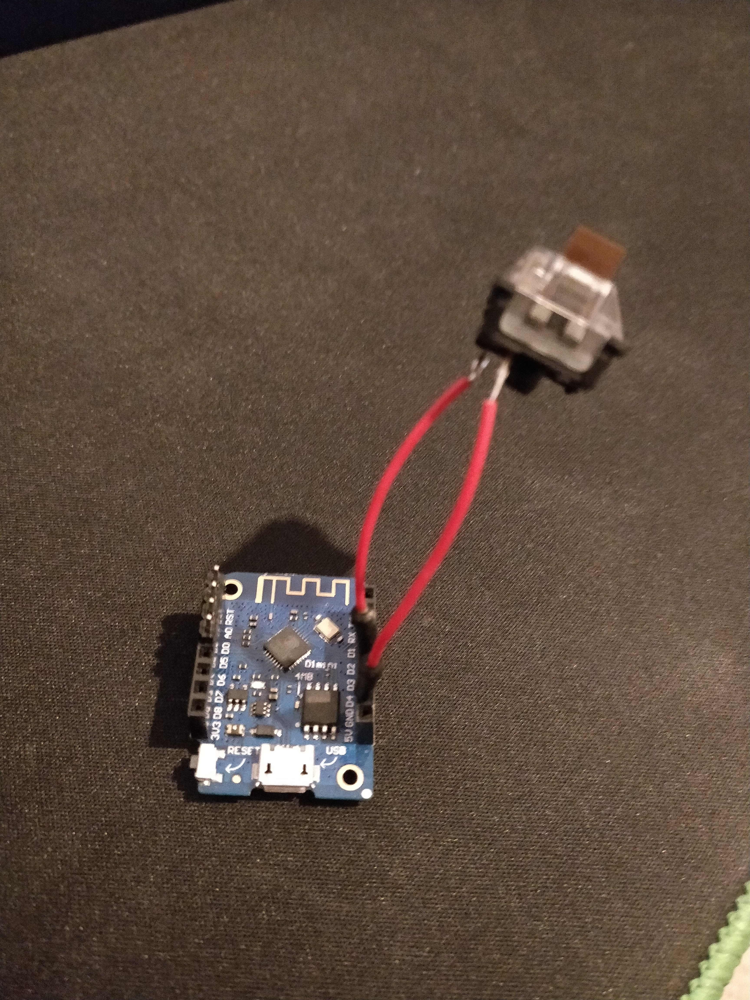

# wifi-remote
Very simple wireless OBS remote

There are 2 parts:
- Go server
- ESP8266 with a physical button

## Go server

The Go part is responsible for the keypress even emulation on the host machine, it starts a websocket server which listens for events.

### Websocket protocol

It is simply a number (in string format) in the payload, for example:

```
1
```

Nothing too complex, the `keyMap` variable contains the mapping between the payload and the actual keyboard keycodes.


## ESP8266

I used a wemos d1 mini, because it's small, cheap and also have some internal pullups.
I used the D3 because of this pullup and connected the button between the D3 and GND.

Picture:



